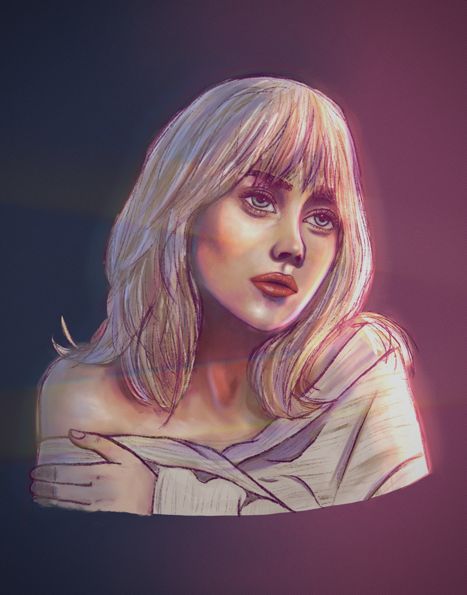
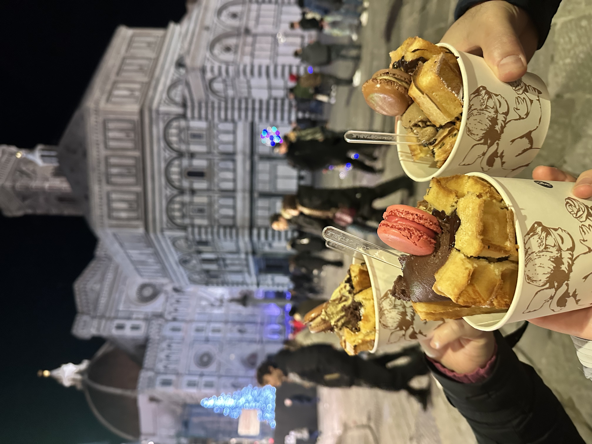
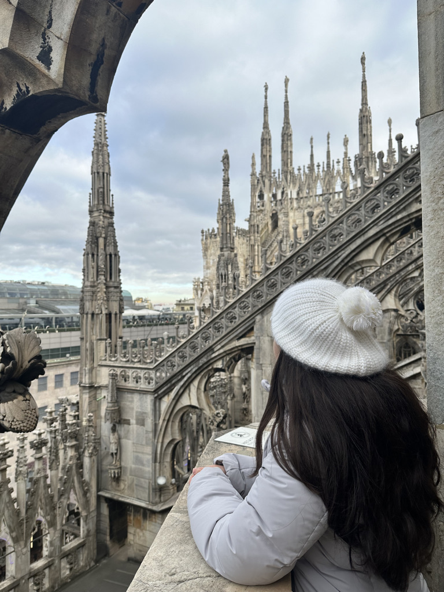

<h1>About Me!</h1>

  <h2>My name is Robiya 🙋🏻‍♀️</h2>
  
  <h2>I'm a senior at USN and a super cool web developer. 👩🏻‍💻😎💅 I have a pet bird, a green cheek conure named Jonny. I'm his favorite person; we are inseparable.</h2>

  <h2>My Hobbies!</h2>
  <h2>I love a variety of things, such as:</h2>
  <ul>
    <li>drawing</li>
     
    <h3>I've been drawing since I was five, and I always had a scketchbook and pencil with me wherever I went (road trips, movie nights, dinner table, etc. Although I don't draw as avidly as I used to, I still draw in my freetime and have recently expanded my horizons into digital art.</h3>
    <li>painting</li>
    
    <h3>I began painting at 8 years old when I went to a painting club outside of school in Brentwood. When I have more time to spare, I enjoy tuning out the world listening to music and painting.</h3>
    <li>playing with my bird</li>
     
    
    <h3>This is my beloved Jonny. We got him when I was 10 years old. He will be 9 years old this summer!</h3>
    <li>binging shows/movies</li>
     
    <h3>Inuyasha was my comfort show during quarantine. I began watching anime in 2019, and my first show was 'Maid-Sama!' I don't watch anime as frequently as before, but my current favorites are 'Spy x Family' and 'A Sign of Affection.' My favorite genres in general in no particular order are action, horror, psychological, and sometimes romance (depends on the trope, some can be overused/cliche).</h3>
    <li>going out with family and friends</li>
     
    <h3>I reslly love exploring my hometown and other places with family and friends. Going out with my close ones makes the experience even better.</h3>
    <li>traveling</li>
    
    <h3>I absolutley love traveling. My family has traveled a lot since I was little, so I can't handle being coopped up in one spot forever. Fun fact, we are also multilingual. We've been to 10 European countries, 11 if you count Türkiye, and our home country, Uzbekistan.</h3>
  </ul>

